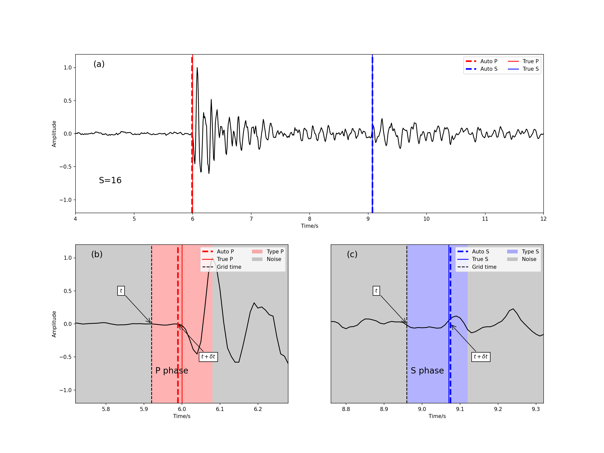

# LPPN: a fast phase picking network



## Introduction

### Summary
We here present one lightweight phase picking network (LPPN) to pick P/S phases from continuous seismic recordings. It first classifies the phase type for consecutive data points with stride S, and then performs regression for accurate phase arrival time. The classification-regression approach and model optimization using deep separable convolution reduce the number of trainable parameters and ensure its computation efficiency. 

### Features
LPPN can be configured to have different model size and run on a wide range of devices. Here are:
- S can be configure as 8, 16, 32, 64, 128 
- n can be any size.

## Requirements
Python>=3.6.0 is required including PyTorch>=1.7

## Pretrained models 
The pretrained models is kept in "ckpt/stride-feature.wave". Here are 12 models with:
- stride = 8,16,32,64 
- frature= 4,8,16 

## Usage
### Data 
The STEAD can be obtained from https://github.com/smousavi05/STEAD. After download the data, then copy the .csv and .h5 file to the data folder. 

### Training
Running lppntrain.py will train the model:
```bash 
python lppntrain.py -f num_of_feature -s num_of_stride -l learning_rate -i data_folder -d device
```
where 
- num_of_feature is the nubmer of features. 
- num_of_stride is the total stride
- learning_rate is the learning rate during training the model
- data_folder is the STEAD data folder 
- device is the running device. 

### Infering
Running lppnvalid.py will valid the model:
```bash 
python lppnvalid.py -f num_of_feature -s num_of_stride -l learning_rate -o output -i data_folder -d device
```
the output file is num_of_feature-num_of_stride.stat.txt in output folder. 

lppnvalid2.py is used to valid multiple models. Such as:
```bash 
python lppnvalid2.py -f 4,8,16 -s 8,16,32 -l learning_rate -o output -i data_folder -d device
```

**Format of result**, a demo result is kept in outdata/4-8.stat.txt, with the flowing format. 
```
#phase,True P,True S(sampling point),Mean SNR 
Type of phase (1 for P and 2 for S),Predicted time,Probability 
....
```

## Picking continous data. 
We designed a pipline for picking continous data. The script is pick.py. 
You can run:
```python 
python pick.py -i data_folder -o result -m model -d device 
```
data_folder is the base folder of the data. LPPN can automatically search all the .mseed data in the folder and all the sub folders. One can pick a countinious data with typical number of phase within 2 seconds on A100 including the IO time and post process time. The name of the data must be NET.STATION.COMPONENT.OTHERINFORMATION.mseed and the three component of the data must in the same folder. However the 30s model is not suitalbe for the low SNR datas, you can contact the authors for the optimized pretrained models(Trained with ChinArray data). 

**Format of result**, a demo result shown below:
```
##数据位置
##震相,相对时间（秒）,置信度,绝对时间（格式%Y-%m-%d %H:%M:%S.%f）,信噪比,前后200个采样点振幅均值,前95%分位数,后95%分位数,最大值,标准差,峰值
#path/to/data/other/information/X1.45001.01.BHE.D.2011.261.14.38.50.mseed
Pg,3581.051,0.941,2011-09-18 15:38:31.055625,2.801,12711.759765625,X1.45001,112.34023437499997,419.1605468749998,132.240234375,702.439453125,67.18669891357422,188.2140350341797,499,12290.958984375,502,12178.759765625
```


## Contact 
cangye@hotmail.com

## Authors
Ziye Yu, Weitao Wang @ CEA-IGP

## License
MIT 
